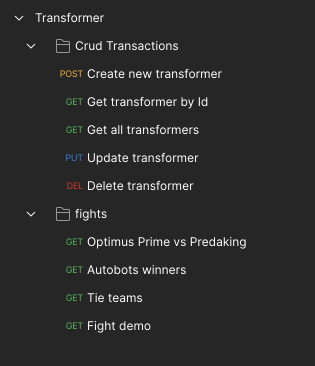
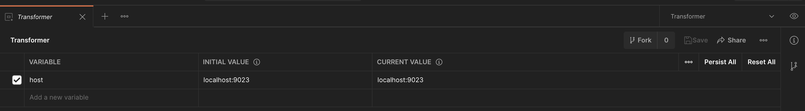

# Transformer Battle

To build and run the project you need to have Java 8+ and Maven 3.6+ installed in your system. After the build, a `transformer/target/` directory is generated for you with a jar file named **transformer.jar** in it. 
Run the jar with the nexts commands:


``` shell
# Clone the source code.
 git clone https://github.com/luisrafaelinf/transformer.git

# Enter the project directory.
cd transformer

# Compile the project.
mvn clean package

or

mvn clean install

# Use the following commands to test the application with the included test files.
java -jar target/transformer.jar 

```

## URL Rest Services:

by default the service url and port is: http/localhos:9023/

- Transformer CRUD:

List all transformers (GET)
> /transformers/v1/

Get information from specific transformer by database ID (GET)
> /transformers/v1/{id}

Create a new transformer (POST)
> /transformers/v1/transformer

Update a transformer (PUT)
> /transformers/v1/{id}

Update a transformer (DELETE)
> /transformers/v1/{id}


- Transformers Battle:

Fight with a list of transformers (GET)
> /transformer/v1/battle

-The above operations are available into a postman file collection located into the directory postman with data to test. This collection file was exported with the version v2.1



As well you will find a enviropment file.



## Database Installation

This project is configurated with H2 database in memory.

## Data for sample

When you run the project there is a Data Loader integrated that populate the tables for you with data for sample.
